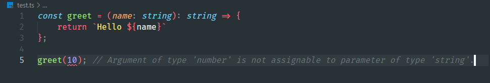
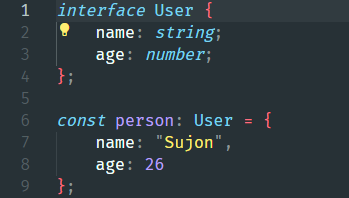
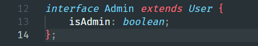
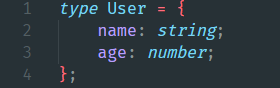

#  📝 Wellcome to my typescript essential blog.

## 1. How typescript helps you write better code.

I hope already you write javascript code before. Already you know that, javascript is flexible not just flexible it,s too flexible. Here is the main problem in javascript. until you don,t run your code. You never understand where is wrong.

Other hand typescript is super set with super power of javascript. Mainly typescript ensure type safety on compile time.It help you catch bugs early and write cleaner code.

###### See typescript stop and show error, when provide a wrong data.

### 💪 Smater autocomplete and hint.

*This make your code faster to write and easier to understand.*

- Safe refactoring.
- Perfect to team work.
- Great for long-term project.

## 2. Interfaces vs types in typescript.

In typescript, both interface and type help you describe, how your data should look. But they have some differences.

### Interface
#### ✅ Use this when describe shape of the object.

#### ✅ Easy to extend.

### Type
#### ✅ Similar to interface.

#### ✅ But type can handle also unions and combine multiple type.

### 💡 So which one to use ?
. Use interface when working with objects and extending them.

. Use type when you need advance type like "sring | number". 

👍Both are great, Choose based on your situation needs.

## 🧑‍💻 Final words.
#### Typescript may look strict at first. But it actually your best friend when codding.
